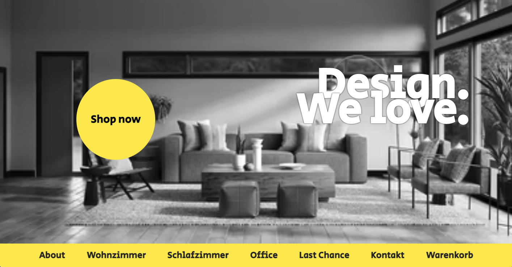

# Bootcamp Exercise - Landing Page

## Table of contents

- [Overview](#overview)
  - [The challenge](#the-challenge)
  - [Screenshot](#screenshot)
  - [Links](#links)
- [My process](#my-process)
  - [Built with](#built-with)
  - [What I learned](#what-i-learned)
  - [Continued development](#continued-development)

## Overview

### The challenge

Users should be able to:

- Design your own Design-Shop landing page

### Screenshot

### Links

- Solution URL: [Add solution URL here](https://stefanseliger.github.io/DesignShop_Bootcamp/)

## My process

### Built with

- Semantic HTML5 markup
- CSS, 

### What I learned

How to make a navigation sticky.  

### Continued development

It´s not yet optimized for other display formats. 

